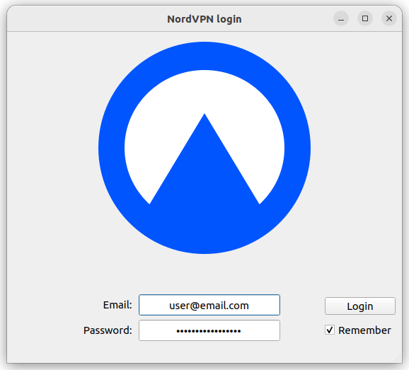
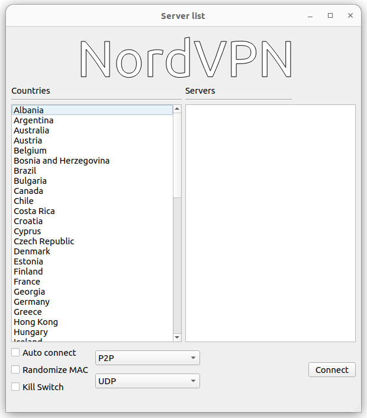

# NordVPN Network Manager GUI

[](https://github.com/vfosterm/NordVPN-NetworkManager-Gui/blob/master/LICENSE)
[](https://github.com/vfosterm/NordVPN-NetworkManager-Gui/issues)
[](https://github.com/vfosterm/NordVPN-NetworkManager-Gui/releases/latest)
[](https://github.com/vfosterm/NordVPN-NetworkManager-Gui/commits/master)
[](https://python.org)





## About

NordVPN Network Manager GUI is a graphical frontend for both NordVPN and the
system Network Manager. All connections are handled directly by the network
manager and user secrets are only stored in memory before being passed to the
Network Manager. Currently it operates 100% as a user process with no need for
root privileges.

## History

This project was inspired by
[NordVPN-NetworkManager](https://github.com/Chadsr/NordVPN-NetworkManager) by
Chadsr. Many thanks for the code and knowledge that they published into the
public domain.

In 2022 Chris Cunningham packaged the program up using Poetry and added lots of
general tooling to make future development easier. Changes include:

-   Reorganizing the repo as expected by PEP 518, and permitting it to be built
    as a standard Python package.
-   Adding a VS Code devcontainer and associated tooling to provide isolation
    of the environment (above that provided by virtualenv) and to permit non-
    Python dependencies and tooling to be described in code.
-   Major refactoring and reorganisation of the original >1200-line monolithic
    class to split helper functions out, to de-duplicate shared code into new
    functions and methods, and to aid in readability.
-   Lots of bug fixes such as Qt errors and problems figuring out the name of
    the VPN if connected to a country with whitespace in the name.
-   The ability to bypass some calls to the (old) NordVPN API, which avoids
    hitting the fairly severe rate-limiting on the server side, and slightly
    speeds up startup.

## Prerequisites

A standard Ubuntu 22.04 desktop install includes all necessary prerequisites
(notably Qt and NetworkManager) except the following:

-   `libxcb-xinerama0`

## Features

-   Light: Uses the system Network Manager, application doesn't need to be
    running
-   Clean: All configuration files are deleted after disconnection
-   Secure: User secrets are passed directly from memory to the Network
    manager, root access is not required
-   Powerful: Supports a variety of different protocols and server types with
    more on the way.
-   Kill Switch: internet connection is disabled if VPN connection is lost
-   Auto Connect: VPN is connection is established on system start
-   Randomize MAC: Random MAC address is assigned before establishing
    connection

## Configuration

The program looks for `~/.nornconfigs/.configs/nord_settings.conf` and will
create it if not present. This contains the following structure:

```cfg
[USER]
user_name = user@email.com

[SETTINGS]
mac_randomizer = false
kill_switch = false
auto_connect = false
json_path = /path/to/api_data.json
```

If `json_path` is specified the the program will skip authenticating against
the NordVPN API and fetching the API data json on startup: this is because this
API has rate-limiting and hitting it constantly will result in rejections. The
credentials used on login are still used to actually authenticate VPN
connections, so should still be entered.

## Running and packaging

The repo uses [Poetry](https://python-poetry.org/) as its build system. Either
launch the repo in a VS Code devcontainer or install Poetry locally using pip;
after that Poetry handles most other dependencies and tooling. (If not using
the devcontainer, you are also advised to install
[Pre-commit](https://pre-commit.com/)) and
[detect-secrets](https://github.com/Yelp/detect-secrets) and run
`pre-commit install` to install the provided pre-commit hooks.)

To run the current code without packaging, run `poetry run nord-nm-gui`.

To package the code, run `poetry build`; additionally, you can package and
install in one step using `pip install .`.

The provided `.desktop` file can be used to add a launcher icon. First install
the package as above, then edit `nord-nm-gui.desktop` to set the `Icon` path to
match your user's Python `site-packages` path. Then copy the file to
`~/.local/share/applications/`.

## TODO

-   ~Poetry~
-   ~Pre-commit and other linting~
-   ~Split helper functions out of GUI class~
-   ~Stop spamming API: dry run by getting JSON once and then commenting calls~
-   ~Fix GUI bugs~
-   ~Use a config option to bypass Nord API calls~
-   ~Change the option to bypass the API so it passes a path for the JSON file~
-   ~Removing copyrighted NordVPN assets and replace with free ones~
-   Convert `print()`s to either status bar / taskbar notices or proper logging
    and re-add the ones that were removed during the rewrite
-   Always cache the `api_data.json` and try to re-use it, with a config option
    to force it to be downloaded
-   Move NM calls to a Python binding instead of shelling out with `subprocess`
-   Handle sudo properly
-   Figure out how to get PyQt5 to use the system light/dark theme (installing
    `adwaita-qt` isn't sufficient)
-   Use `xdg` for handling config paths
-   Fix the .desktop icon path to be generic or put the icon where it's needed
-   Add tests
-   Add support for obfuscated servers
-   Package with PyInstaller or standard linux packaging tools
-   Add a map selector
-   Upstream

## WARNING

Make sure to disable WebRTC in your browser of choice. Using WebRTC may leak
your original IP address.
